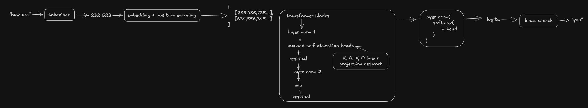

# smolgpt
a small generative pre-trained transformer model implemented in pytorch.

```python
class Transformer(torch.nn.Module):
    """gpt 2 like transformer architecture"""
    def __init__(self, d_model=embed_dim, n_heads=12, dropout=0.1, n_layers=12):
        super().__init__()
        # tokenizer
        self.tokenizer = AutoTokenizer.from_pretrained("gpt2")
        self.n_layers = n_layers
    
        # embedding layer
        self.embedding_layer = EmbeddingLayer(vocab_size, d_model, dropout, block_size)
        # transformer blocks
        self.blocks = torch.nn.ModuleList()
        for _ in range(n_layers):
            self.blocks.append(TransformerBlock(d_model, n_heads, dropout))
        # final layer norm
        self.final_layer_norm = LayerNorm(d_model, True)
        # linear projection to vocab
        self.lm_head = torch.nn.Linear(d_model, vocab_size, bias=False)

        self.embedding_layer.token_embedding.weight = self.lm_head.weight 
        
        _init(self)

def linear_projection(token_embedding, Wq, Wk, Wv):
    """learnt weights for turning token embedding into K, Q, V"""
    K = Wk(token_embedding)
    Q = Wq(token_embedding)
    V = Wv(token_embedding)
    return K, Q, V

def mased_self_attention(x, Wq, Wk, Wv, Wo, n_heads, d_head):
    """get weighted sums between all tokens by batching masked attention calculations"""
    batchs, token_sequences, dimension = x.shape
    K, Q, V = linear_projection(x, Wq, Wk, Wv)
    Q = Q.view(batchs, token_sequences, n_heads, d_head).transpose(1, 2)
    K = K.view(batchs, token_sequences, n_heads, d_head).transpose(1, 2)
    V = V.view(batchs, token_sequences, n_heads, d_head).transpose(1, 2)

    attention_scores = (Q @ K.transpose(-2, -1)) / math.sqrt(d_head)
    mask = torch.tril(torch.ones(token_sequences, token_sequences, device=x.device)).view(1, 1, token_sequences, token_sequences)  
    attention_scores = attention_scores.masked_fill(mask == 0, -1e9)  # apply mask

    weights = torch.softmax(attention_scores, dim=-1)
    weighted_sums = weights @ V
    retun Wo(weighted_sums.transpose(1, 2).contiguous().view(batchs, token_sequences, dimension))

class TransformerBlock(torch.nn.Module):
    """learns liguistic patterns: compute attention and MLP with norms and residual connections"""
    def __init__(self, d_model=embed_dim, n_heads=12, dropout=0.1):
        super().__init__()
        # normalize list of token embeddings
        self.norm_1 = LayerNorm(embed_dim, True)
        self.norm_2 = LayerNorm(embed_dim, True)
        # learn KQV weights for each token embedding
        self.Wq, self.Wk, self.Wv = (
            torch.nn.Linear(embed_dim, embed_dim, bias=False),
            torch.nn.Linear(embed_dim, embed_dim, bias=False),
            torch.nn.Linear(embed_dim, embed_dim, bias=False),
        )
        self.Wo = torch.nn.Linear(d_model, d_model, bias=False)
        # 'room to learn new patterns' 768 -> 3072 -> non linear artivation (GELU) -> 768
        self.MLP = MLP(d_model, dropout)

    def forward(self, x):
        x = self._residual(x, self.norm_1, self._self_attention)
        x = self._residual(x, self.norm_2, self.MLP)
        return x

    def _residual(self, x, normal, sublayer):
        return x + sublayer(normal(x))

    def _self_attention(self, x):
        d_head = self.d_model // self.n_heads
        return mased_self_attention(x, self.Wq, self.Wk, self.Wv, self.Wo, self.n_heads, d_head)

def MLP(d_model=embed_dim, dropout=0.1):
    return torch.nn.Sequential(
        torch.nn.Linear(d_model, d_model * 4, bias=False),  # eg: 768 -> 3072
        torch.nn.GELU(),  # non-linear activation function
        torch.nn.Linear(d_model * 4, d_model, bias=False),  # eg: 3072 -> 768
        torch.nn.Dropout(
            dropout
        ),  # randomly drop out some tokens to prevent overfitting
    )
```

## getting started
1. install dependencies
```bash
python -m venv .venv
pip install -r requirements.txt
./.venv/Scripts/activate
```

2. train
```bash
python prepare.py shakespeare_char # prepare data
python train.py # train model weights
```

3. generate text
```bash
python use.py "Once upon a time"
```

